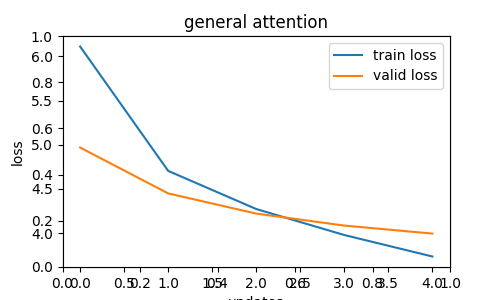
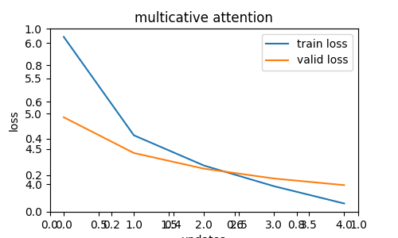
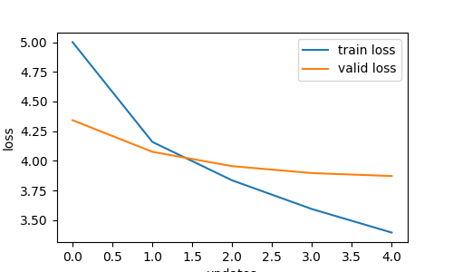
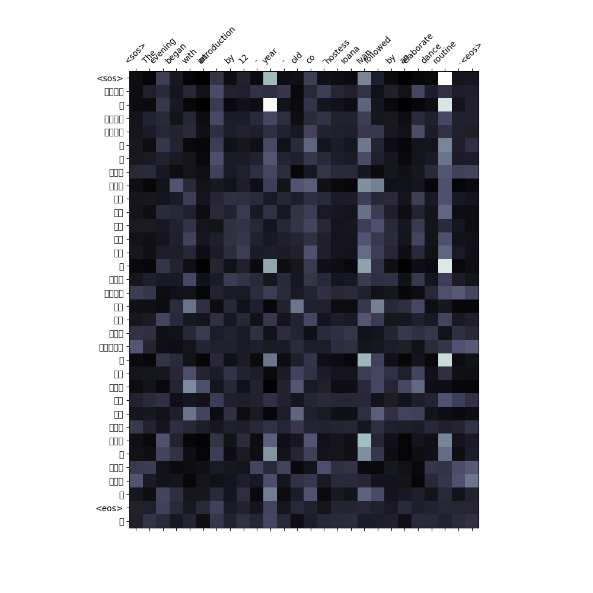
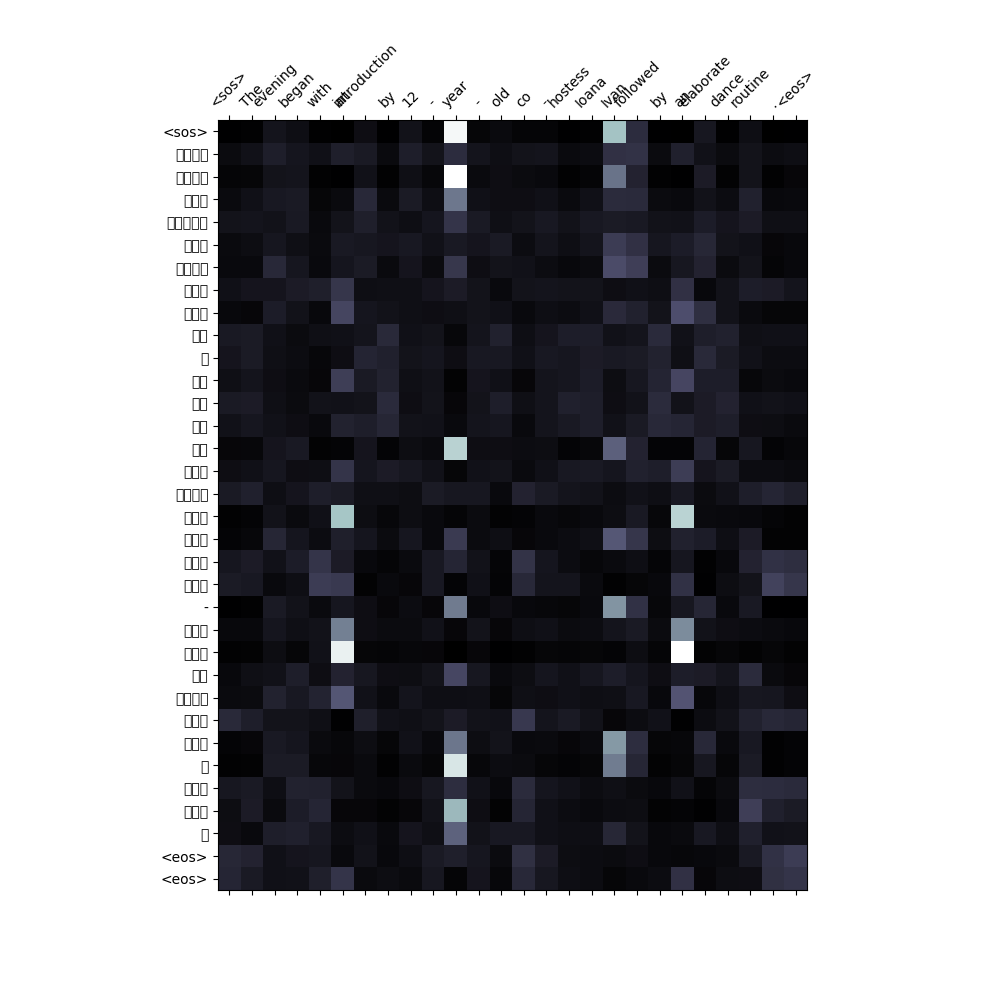
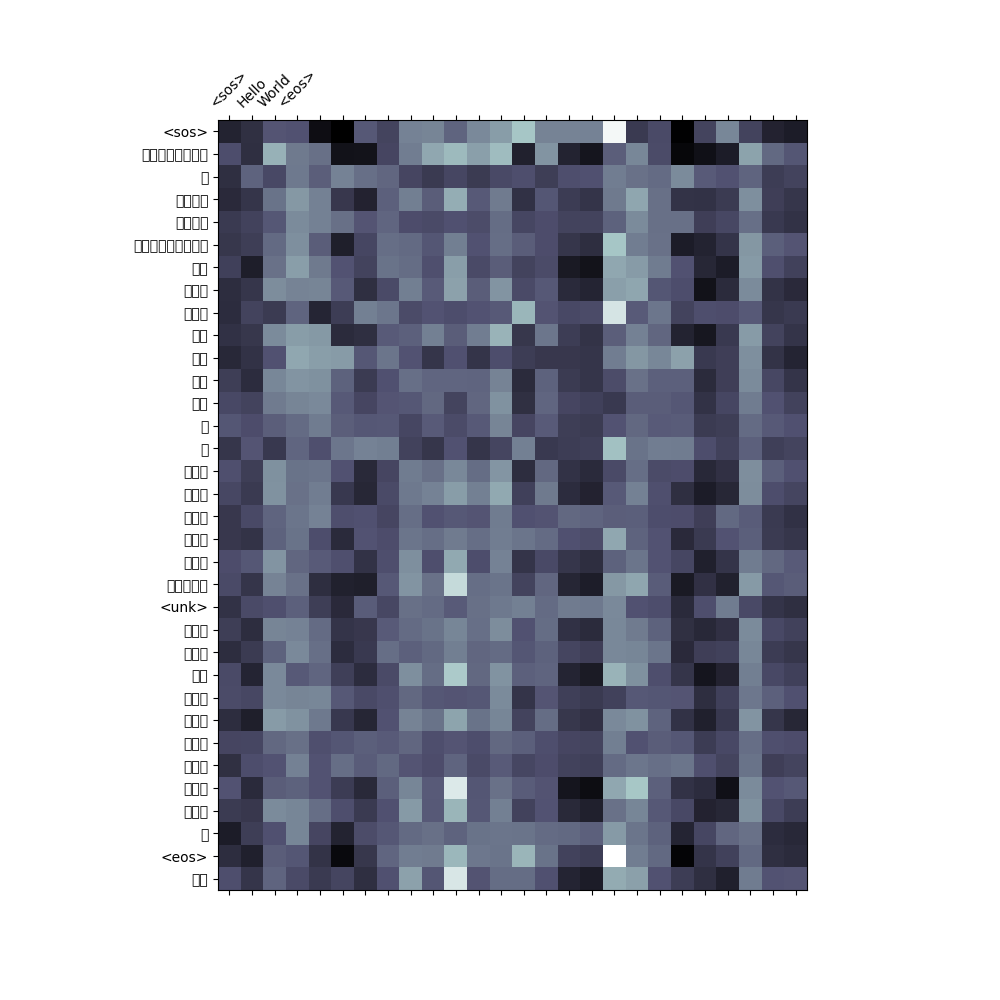
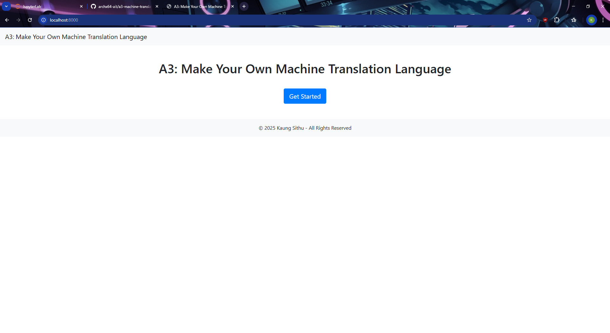
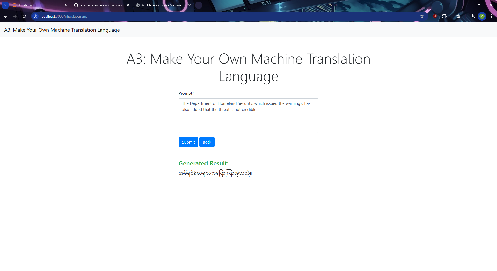
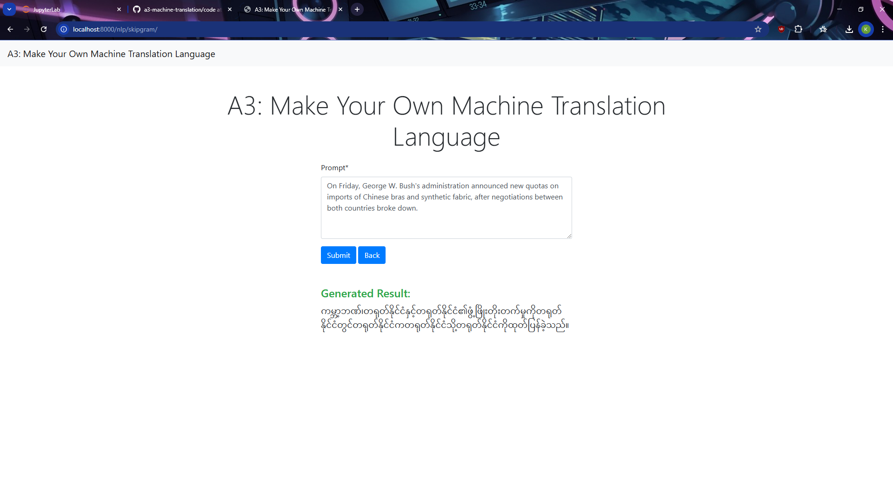

# a3-machine-translation

## Student Information

- ID: st124974
- Name: Kaung Sithu

## Get Language Pair

### Dataset

1. Dataset used for translation between English and Burmese

    - Ye Kyaw Thu, Win Pa Pa, Masao Utiyama, Andrew Finch, and Eiichiro Sumita. (2016). "Introducing the Asian Language Treebank (ALT)" Oriental COCOSDA. <https://www2.nict.go.jp/astrec-att/member/mutiyama/ALT/>

2. Process of preparing the dataset for use in your translation model

    - The raw text files, one for English and one for Burmese, contain lines of text, each prefixed with a unique identifier such as ```SNT.123.456```. The goal is to remove these identifiers while preserving the actual text. A function processes each line of the input files to strip away the identifier using a regular expression. Only non-empty lines are saved to new output files, resulting in cleaned versions of the original text files.
    - After cleaning, the English and Burmese text files are paired into a single dataset. Each line in the English file corresponds to the same line in the Burmese file, forming a parallel sentence pair. These pairs are written into a CSV file, with two columns: one for English (en) and one for Burmese (my). This CSV file serves as the structured dataset for further processing. The CSV file is loaded into a dataset object using a library like datasets. This allows the data to be easily manipulated and split for machine learning tasks.
    - The dataset is divided into three subsets: training, validation, and test sets. First, the dataset is split into a training set (70%) and a temporary test set (30%). The temporary test set is then further divided equally into validation and test sets (15% each). This ensures a balanced distribution of data for model training, evaluation, and testing.
    - The final dataset, now organized into training, validation, and test splits, is uploaded to the Hugging Face Hub. This makes the dataset publicly accessible or available for private use, allowing others to easily load and use it for machine learning tasks.
    - The code for preprocessing can be found in ```code/preprocessing.ipynb```. The raw and cleaned data files are in ```code/data/```.
    - The preprocessed dataset on Hugging Face <https://huggingface.co/datasets/archx64/english-burmese-parallel>

### Tokenizing Burmese

This tokenizer relies on ICU4C/ICU4J (International Components for Unicode) <https://icu.unicode.org/>, accessed via the PyICU Python wrapper. PyICU provides bindings for ICU's text processing tools, which handle complex languages like Burmese. PyICU for Windows is downloaded from this link: <https://github.com/cgohlke/pyicu-build/releases>.

```python
from icu import BreakIterator, Locale

TRG_LANGUAGE = 'my'

def burmese_tokenizer(sentence):
    bi = BreakIterator.createWordInstance(Locale(TRG_LANGUAGE))
    bi.setText(sentence)
    tokens = []
    start = bi.first()
    for end in bi:
        token = sentence[start:end].strip()  # remove leading/trailing spaces
        if token:  # only add non-empty tokens
            tokens.append(token)
        start = end
    return tokens
```

The function `burmese_tokenizer` executes the following:

- initializes a BreakIterator instance for word segmentation in Burmese
- sets the input sentence for iterator
- iterates over break points to extract tokens
- returns a list of words

## Experiment with Attention Mechanisms

Navigate to the ```code``` directory. The sequence-to-sequence neural networks are implemented across different notebooks:

- ```a3-transformer-gernal.ipynb``` for general attention
- ```a3-transformer-multiplicative.ipynb``` for multiplicative attention
- ```a3-transformer-additive.ipynb``` for additive attention.

## Evaluation and Verification

All models are trained only 5 epoches. It takes around 17-18 seconds to complete one epoch for general and multiplicative models. The addictive attention model takes approximately 47 seconds to complete an epoch. Batch sizes for general and multiplicative attention models are 128. Additive Attention model uses only 16 batches since it is memory intensive, which causes GPU memory to run out and crashes the training process.

| Attentions | Training Loss | Training PPL | Validation Loss | Validation PPL | Total Training Time |
|------------|---------------|--------------|-----------------|----------------|---------------------|
| General Attention        | 3.735 | 41.908 | 3.995 | 54.324 | 1m 26s 880ms |
| Multiplicative Attention | 3.727 | 41.565 | 3.988 | 53.927 | 1m 32s 10ms |
| Additive Attention       | 3.395 | 29.819 | 3.872 | 48.032 | 3m 56s 198ms |

### Performance Comparison of Attention Mechanisms for English to Burmese Translation

1. Translation Accuracy
    - Additive Attention achieves the lowest validation loss (3.872) and perplexity (48.032), indicating better translation quality.
    - Multiplicative Attention performs slightly better than General Attention, with marginally lower validation loss (3.988 vs. 3.995) and perplexity (53.927 vs. 54.324).
    - Additive Attention also produces a more coherent translation, retaining a better word structure and sequence.

2. Computational Efficieny
    - General and Multiplicative Attention are significantly faster, completing training in about 1m 26s–1m 33s.
    - Additive Attention takes much longer (3m 57s), reflecting its higher computational cost due to additional parameterized transformations.

### Performance Plots Showing Training and Validation Loss

General Attention Loss Curve


Multiplicative Attention  Loss Curve


Additive Attention  Loss Curve


### Attention Maps

General Attention


Multiplicative Attention


Additive Attention


### Effectiveness of Selected Attention Mechanism

- original sentence:
  - The evening began with an introduction by 12-year-old co-hostess Ioana Ivan, followed by an elaborate dance routine.
- translation by general attention:
  - တွင်အနာရီတွင်အအရေးတစ်အာအာဆာအာနီအဆက်သွယ်မှမှသောခြင်း၊မှတစ်ခုမှင့်အတူ၊ခဲ့သည်။လ။
- tranlation by multiplicative attention:
  - တွင်မနေ့ရက်အရွယ်တစ်ထုတ်ရေးတစ်အေအမီအေနီအေဆက်သွယ်တစ်တစ်သောသော-တစ်တစ်ခုတွင်င့် အတူ၊ခဲ့သော ။
- translation by additive attention:
  - ဖျော်ဖြေလနာရီတွင်အမျိုးသားဖွရေးတစ်ပီပီဆာပီကကဆက်ခဲ့ကိုတစ်သည်ခြင်းတစ်တစ်ခုကို ည့အတူတစ်ခဲ့သည်။

Since translation accuracy is usually the key concern in Seq2Seq tasks, my choice is Additive Attention, despite its higher computational cost. It provides the best translation quality, which is crucial for handling a complex language pair like English-Burmese.

## Web Application Development

Navigate to the ```app``` directory and execute the following command:

```bash
python manage.py runserver
```

### User Inferface

Welcome Page


Sample Translation 1


Sample Translation 2


### How the Web Application Interfaces with the Language Model

#### Workflow

1. User Input Submission  
   - The user submits text through a form in the `nlp.html` template.
   - The input text is processed by `NLPFormView`, which validates the form.

2. Text Processing and Model Inference  
   - The `translate` method in `NLPFormView` processes the input text.
   - The text is tokenized using `text_transform[SRC_LANGUAGE]` and prepared as input for the Transformer model.
   - The Transformer model encodes the input and generates a sequence of translated tokens using an autoregressive decoding approach.

3. Model Execution  
   - The model (`Seq2SeqTransformer`) is preloaded using `torch.load(MODEL_PATH, map_location=device)`.
   - The source sequence is passed to the encoder.
   - The decoder predicts one token at a time until it generates the end-of-sequence (`EOS_IDX`) token.

4. Translation Output  
   - The generated token sequence is converted back into text using `vocab_transform[TRG_LANGUAGE].get_itos()`.
   - The translated text is returned as a string.

5. Result Rendering  
   - The translated text is passed as context to the `success.html` template.
   - The output is displayed on the web page.

#### Views Handling

- `NLPFormView` class:  
  - Loads the model and processes user input.
  - Calls `translate()` to generate translated output.
  - Renders the result in the response.

#### Model Processing

- Input text is tokenized, padded, and masked before passing to the encoder.
- The decoder predicts tokens sequentially using previous outputs.

#### User Interface

- Users interact via an HTML form (`NLPForm`).
- Input is submitted through a `textarea` widget.
- The translated result is displayed on the success page.
