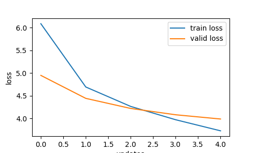

# a3-machine-translation

| Attentions | Training Loss | Training PPL | Validation Loss | Validation PPL | Total Training Time |
|------------|---------------|--------------|-----------------|----------------|---------------------|
| General Attention        | 3.735 | 41.908 | 3.995 | 54.324 | 1m 26s 880ms |
| Multiplicative Attention | 3.727 | 41.565 | 3.988 | 53.927 | 1m 32s 10ms |
| Additive Attention       | 3.395 | 29.819 | 3.872 | 48.032 | 3m 56s 198ms |

## Evaluation and Verification

### English to Burmese translation

- original sentence:
  - The evening began with an introduction by 12-year-old co-hostess Ioana Ivan, followed by an elaborate dance routine.
- translation by general attention:
  - တွင်အနာရီတွင်အအရေးတစ်အာအာဆာအာနီအဆက်သွယ်မှမှသောခြင်း၊မှတစ်ခုမှင့်အတူ၊ခဲ့သည်။လ။
- tranlation by multiplicative attention:
  - တွင်မနေ့ရက်အရွယ်တစ်ထုတ်ရေးတစ်အေအမီအေနီအေဆက်သွယ်တစ်တစ်သောသော-တစ်တစ်ခုတွင်င့် အတူ၊ခဲ့သော ။
- translation by additive attention:
  - ဖျော်ဖြေလနာရီတွင်အမျိုးသားဖွရေးတစ်ပီပီဆာပီကကဆက်ခဲ့ကိုတစ်သည်ခြင်းတစ်တစ်ခုကို ည့အတူတစ်ခဲ့သည်။

### Performance Comparison of Attention Mechanisms for English to Burmese Translation

1. Translation Accuracy
    - Additive Attention achieves the lowest validation loss (3.872) and perplexity (48.032), indicating better translation quality.
    - Multiplicative Attention performs slightly better than General Attention, with marginally lower validation loss (3.988 vs. 3.995) and perplexity (53.927 vs. 54.324).
    - Additive Attention also produces a more coherent translation, retaining a better word structure and sequence.

2. Computational Efficieny
    - General and Multiplicative Attention are significantly faster, completing training in about 1m 26s–1m 33s.
    - Additive Attention takes much longer (3m 57s), reflecting its higher computational cost due to additional parameterized transformations.

3. Overall Effectiveness
    - Since translation accuracy is usually the key concern in Seq2Seq tasks, my choice is Additive Attention, despite its higher computational cost. It provides the best translation quality, which is crucial for handling a complex language pair like Burmese-English.

### Performance plots showing training and validation loss

General Attention

Multiplicative Attention

Additive Attention

### Attention maps

General Attention

Multiplicative Attention
